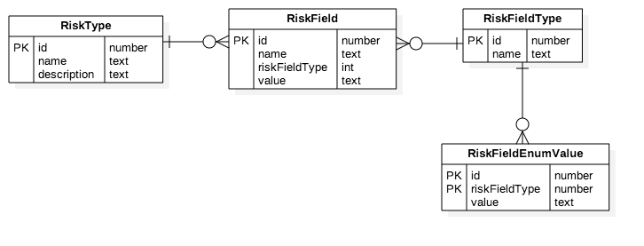

# flask-vue
Sample project using flask and vue.js ecosystem.
It aims to solve a business problem regarding the definition of customizable risk types within the context of an insurance.

## Live demo
It is available a version deployed with Heroku [flask-vue](https://flask-vue-risk-types.herokuapp.com/) .

## Getting Started

These instructions will get you a copy of the project up and running on your local machine for development and testing purposes. See deployment for notes on how to deploy the project on a live system.

### Prerequisites

What things you need to install the software.

```
git
python
```

### Installing

A step by step series of examples that tell you have to get a development env running

1. Clone the repo:
```
git clone https://github.com/antomor/flask-vue.git
```

2. Go into the directory which just cloned the repository in:

```
cd flask-vue
```

3. Install the back-end dependencies
```
pip install -r requirements.txt
```

4. Move into the client app directory
```
cd app/client/app
```

3. Install the front-end dependencies
```
npm install
```

4. Build the front-end app
    1. in development-mode 
    ```
    npm run dev 
    ```
    2. in production mode
    ```
    npm run build 
    ```

**Important: In order to let the client app to point to the right backend API, check the URL set in the `backend.js` file.**

5. Move back to the root project directory
```
cd ../../../
```

6. Database: it has to be generated
```
python manage.py db upgrade
```
It can be also filled with an initial set of data:
```
python manage.py seed
```

For any change it can be upgraded with:

```
python manage.py db migrate 
```
and 
```
python manage.py db upgrade
```

The default location of the database is `/tmp/flask-vue.db`, but it can be easily changed by setting the environment variable `SQLALCHEMY_DATABASE_URI`

Here an ER diagram of the data model.


7. Run the application
```
python run.py (or flask run)
```

8. See the application in the browser
```
127.0.0.1:5000
```

## Running the tests

Explain how to run the automated tests for this system.

### Break down into end to end tests

The repository contains test for the api and for the front-end part.

1. API tests
```
python test_api.py
```
2. Front-end Unit tests
```
No unit test configured at the moment.
```
3. E2E tests
```
No e2e tests configured at the moment.
```

## Deployment

Add additional notes about how to deploy this on a live system

## Built With

* [flask](http://flask.pocoo.org/) - The web framework used
* [vue.js](https://vuejs.org/) - Dependency Management
* [flask-SQLAlchemy](http://flask-sqlalchemy.pocoo.org/2.3/) - flask extension to add support for SQLAlchemy (ORM)

## Authors

* **Antonio Morrone** - [Antomor](https://github.com/antomor)

## License

This project is licensed under the MIT License - see the [LICENSE.md](LICENSE.md) file for details

## Acknowledgments

* BriteCore
